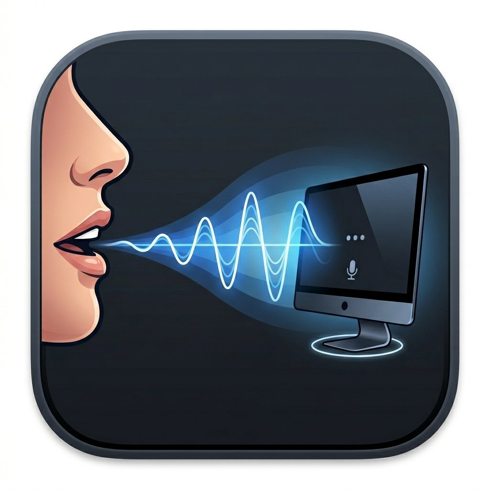
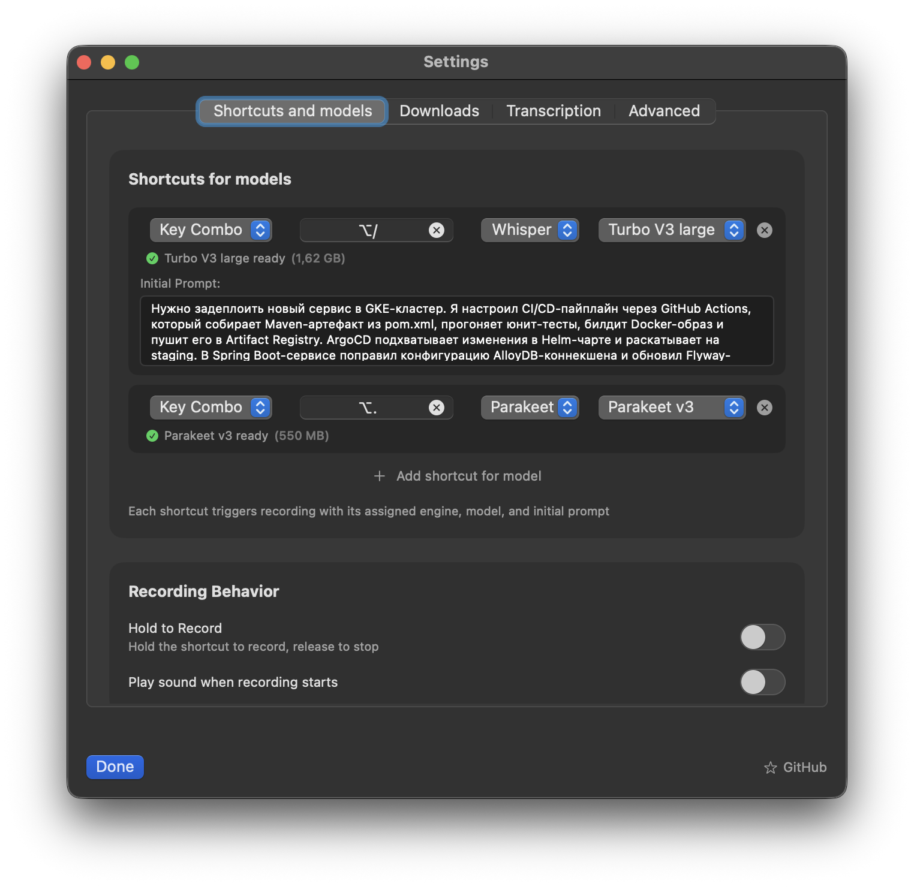

<p align="center">

</p>

# Wisp

Wisp is a macOS menu-bar app for speech-to-text transcription. Press a shortcut, speak, and the transcribed text is instantly pasted into your active app — Slack, Claude Desktop, your IDE, anywhere.

> Wisp is a friendly fork of [OpenSuperWhisper](https://github.com/Starmel/OpenSuperWhisper) by [@Starmel](https://github.com/Starmel) — renamed for brevity, with added Ukrainian language support, multiple engine support, and many other improvements.

<p align="center">
 
</p>

## Features

- **Two transcription engines** — choose per-shortcut:
  - [Whisper](https://github.com/ggerganov/whisper.cpp) (whisper.cpp) — **recommended**, best quality (~2.5% WER), 99 languages, supports initial prompt
  - [Parakeet](https://github.com/FluidInference/FluidAudio) (NVIDIA NeMo) — lightning-fast (~6% WER), 25 European languages, no prompt support
- **Multiple shortcut bindings** — assign different key combos to different engine/model combinations (up to 5)
- **Initial Prompt** (Whisper only) — not a system prompt; provide a sample of expected output text to guide style, spelling, and formatting (e.g. proper nouns, punctuation, casing)
- **Drag & drop** audio files for transcription with queue processing
- **Microphone selection** — switch between built-in, external, Bluetooth and iPhone (Continuity) mics from the menu bar
- **Recording indicator** — floating window near your cursor shows recording state
- **Shortcut controls**:
  - Press shortcut once to start recording, press again to stop and transcribe
  - Press **Escape** to cancel recording without transcribing
  - Shortcuts are ignored while a transcription is in progress
- **Hallucination filter** — automatically discards phantom outputs from silence ("Thank you", "Subscribe", etc.)
- **Multiple language support** with auto-detection and translate-to-English option
- **Model downloads** — download Whisper and Parakeet models directly from the app

### Recommended setup

Use two shortcut bindings — one for accuracy, one for speed:

| Shortcut | Engine | Model | Use case |
|---|---|---|---|
| e.g. `Cmd+Shift+1` | Whisper | Large V3 Turbo Q5 | Best accuracy, longer recordings, multilingual |
| e.g. `Cmd+Shift+2` | Parakeet | Multilingual | Quick notes, instant transcription |

## Installation

### Homebrew

```shell
brew install --cask andrii-rubtsov/tap/wisp
```

### Manual

Download the DMG from the [Releases page](https://github.com/andrii-rubtsov/Wisp/releases).

## Requirements

- macOS 14.0 (Sonoma) or later
- Apple Silicon (ARM64)

## Building locally

```shell
git clone git@github.com:andrii-rubtsov/Wisp.git
cd Wisp
brew install libomp
./run.sh build
```

Whisper.cpp is provided as a pre-built XCFramework via the [whisper-cpp-swift](https://github.com/andrii-rubtsov/whisper-cpp-swift) Swift package — no cmake or submodule setup required.

If you run into issues, see `.github/workflows/release.yml` — the CI workflow builds and releases the app automatically on every push to master.

## Contributing

Contributions are welcome! Please feel free to submit pull requests or create issues for bugs and feature requests.

## License

Wisp is licensed under the MIT License. See the [LICENSE](LICENSE) file for details.
